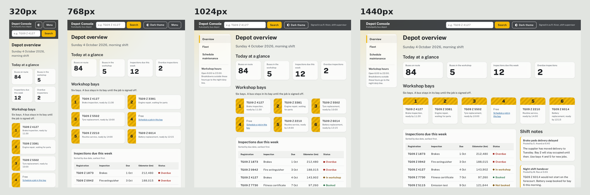
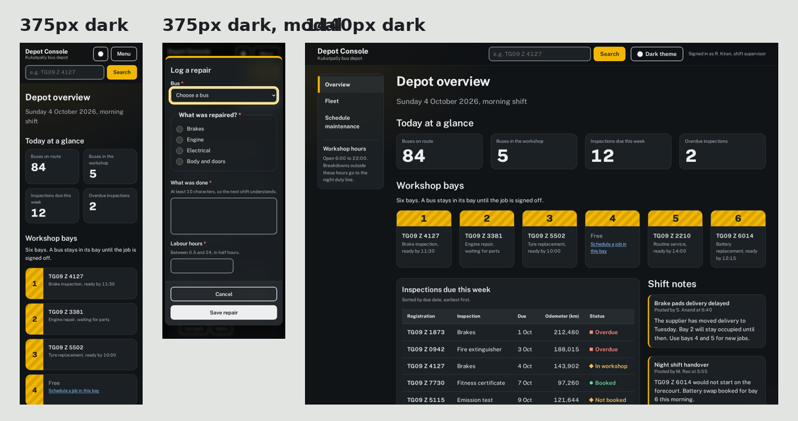

# Depot Console: Responsive Design Tokens & Mobile-First CSS

The Depot Console dashboard, restyled with a token-based, mobile-first CSS architecture. Everything visual lives in one file, [`style.css`](style.css): design tokens, a responsive 12-column dashboard grid, light and dark themes, subtle glass surfaces, soft shadows and hover transitions.





## Project structure

```
responsive-dashboard/
├── index.html            # Overview dashboard (12-column grid at 1440px)
├── vehicles.html         # Fleet table + modal dialogs
├── maintenance.html      # Accessible form
├── style.css             # All styles: tokens, layout, components, breakpoints, themes
├── js/
│   ├── theme.js          # Light/dark toggle, remembers the choice, follows the OS by default
│   ├── sidebar.js        # Mobile menu toggle
│   ├── modal.js          # Native <dialog> handling
│   └── form-validation.js
├── fonts/                # Public Sans, self-hosted (SIL Open Font License)
└── screenshots/          # Responsive proof screenshots
```

## Design tokens

All tokens are defined once in `:root` in `style.css`. Components never use raw values; they only reference tokens, so changing a token changes the whole app.

| Group | Tokens | Notes |
|-------|--------|-------|
| Brand colours | `--brand-asphalt`, `--brand-signal`, `--brand-steel` | Depot tarmac grey, bay-marking yellow, link blue |
| Semantic colours | `--color-bg`, `--color-surface`, `--color-text`, `--color-text-muted`, `--color-border`, `--color-primary`, `--color-accent`, `--color-ok`, `--color-due`, `--color-danger`, `--color-focus` ... | Components use these, so themes only swap this layer |
| Typography | `--font-sans`, `--step--1` to `--step-4`, `--leading-*`, `--weight-*`, `--measure` | Fluid scale with `clamp()`: grows smoothly from 320px to 1440px, no jumps |
| Spacing | `--space-3xs` to `--space-xl`, fluid `--gutter` and `--grid-gap` | Page padding and grid gaps scale with the screen |
| Radii | `--radius-s` (4px), `--radius-m` (10px), `--radius-l` (16px), `--radius-pill` | Small for inputs, large for panels |
| Elevation | `--shadow-1`, `--shadow-2`, `--shadow-3` | Soft layered shadows: resting, hover, modal |
| Glass | `--glass-blur`, `--glass-saturate` | Used by `backdrop-filter` on the header, panels and modals |
| Motion | `--ease-out`, `--duration-fast`, `--duration-base` | Shared timing for all transitions |
| Sizes | `--sidebar-width`, `--content-max`, `--tap-target` (44px) | |

## Mobile-first breakpoints

Base styles are written for a 320px phone. Each breakpoint only adds layout with `min-width` media queries.

| Breakpoint | Layout |
|------------|--------|
| **320px** (base) | One column. Search drops to its own row. Sidebar sits behind a "Menu" button. Theme toggle is icon-only. Tables become stacked cards (column names come from `data-label`), so nothing scrolls sideways. Modals fill the screen. |
| **768px** | Header on one row. Figures in 4 columns, workshop bays in 2. Overview table returns to a normal table. Fleet cards show 2 per row. Form fields pair up in 2 columns. |
| **1024px** | Sidebar becomes a permanent sticky column. Bays in 3 columns. The wide fleet table becomes a real table. Row hover highlight. |
| **1440px** | Dashboard switches to a 12-column grid with named areas: figures (12), all 6 bays in one row (12), inspections table (8) beside shift notes (4). |

Grid and Flexbox are both used deliberately: **Grid** for two-dimensional layout (page shell, dashboard areas, figures, bays, form rows) and **Flexbox** for one-dimensional rows (header, button groups, footer, table-card rows).

## Themes and visual styling

- **Light and dark themes** come from swapping semantic colour tokens. The app follows the operating system setting by default; the header toggle overrides it and remembers the choice. The toggle uses `aria-pressed`, so screen readers announce whether dark theme is on.
- **Glassmorphism**: the sticky header, panels and modals use `backdrop-filter: blur()` over two soft background glows. It stays subtle so text contrast is unaffected.
- **Soft shadows** in three levels, and **hover transitions** on buttons, bays, nav links, inputs and table rows (hover effects only on devices that can hover).
- **Fallbacks**: solid surfaces when the browser lacks `backdrop-filter` or the user prefers reduced transparency; no animation for reduced motion; visible borders in Windows high-contrast mode.

## Testing: zero horizontal scroll

Tested automatically in Chromium (Playwright) on all 3 pages, at 6 widths, in both themes, plus with a modal open. For each check the page's scroll width was measured against the screen width, and every element was checked for sticking out past the right edge.

**Result: 40 checks, 0 horizontal scrollbars, 0 overflowing elements, 0 JavaScript errors.**

<details>
<summary>Full results</summary>

| Theme | Width | Page | Page width | Screen width | Horizontal scroll |
|---|---:|---|---:|---:|---|
| light | 320px | index.html | 320px | 320px | None |
| light | 320px | vehicles.html | 320px | 320px | None |
| light | 320px | maintenance.html | 320px | 320px | None |
| light | 375px | index.html | 375px | 375px | None |
| light | 375px | vehicles.html | 375px | 375px | None |
| light | 375px | maintenance.html | 375px | 375px | None |
| light | 375px | vehicles.html (modal open) | 375px | 375px | None |
| light | 768px | index.html | 768px | 768px | None |
| light | 768px | vehicles.html | 768px | 768px | None |
| light | 768px | maintenance.html | 768px | 768px | None |
| light | 1024px | index.html | 1024px | 1024px | None |
| light | 1024px | vehicles.html | 1024px | 1024px | None |
| light | 1024px | maintenance.html | 1024px | 1024px | None |
| light | 1024px | vehicles.html (modal open) | 1024px | 1024px | None |
| light | 1440px | index.html | 1440px | 1440px | None |
| light | 1440px | vehicles.html | 1440px | 1440px | None |
| light | 1440px | maintenance.html | 1440px | 1440px | None |
| light | 1920px | index.html | 1920px | 1920px | None |
| light | 1920px | vehicles.html | 1920px | 1920px | None |
| light | 1920px | maintenance.html | 1920px | 1920px | None |
| dark | 320px | index.html | 320px | 320px | None |
| dark | 320px | vehicles.html | 320px | 320px | None |
| dark | 320px | maintenance.html | 320px | 320px | None |
| dark | 375px | index.html | 375px | 375px | None |
| dark | 375px | vehicles.html | 375px | 375px | None |
| dark | 375px | maintenance.html | 375px | 375px | None |
| dark | 375px | vehicles.html (modal open) | 375px | 375px | None |
| dark | 768px | index.html | 768px | 768px | None |
| dark | 768px | vehicles.html | 768px | 768px | None |
| dark | 768px | maintenance.html | 768px | 768px | None |
| dark | 1024px | index.html | 1024px | 1024px | None |
| dark | 1024px | vehicles.html | 1024px | 1024px | None |
| dark | 1024px | maintenance.html | 1024px | 1024px | None |
| dark | 1024px | vehicles.html (modal open) | 1024px | 1024px | None |
| dark | 1440px | index.html | 1440px | 1440px | None |
| dark | 1440px | vehicles.html | 1440px | 1440px | None |
| dark | 1440px | maintenance.html | 1440px | 1440px | None |
| dark | 1920px | index.html | 1920px | 1920px | None |
| dark | 1920px | vehicles.html | 1920px | 1920px | None |
| dark | 1920px | maintenance.html | 1920px | 1920px | None |
</details>

All HTML pages and `style.css` also pass the W3C Nu validator with 0 errors and 0 warnings.

## Screenshots

| Page | 320px | 768px | 1024px | 1440px | Dark |
|------|-------|-------|--------|--------|------|
| Overview | [view](screenshots/index-320-light.png) | [view](screenshots/index-768-light.png) | [view](screenshots/index-1024-light.png) | [view](screenshots/index-1440-light.png) | [375px](screenshots/index-375-dark.png), [1440px](screenshots/index-1440-dark.png) |
| Fleet | [view](screenshots/vehicles-320-light.png) | [view](screenshots/vehicles-768-light.png) | [view](screenshots/vehicles-1024-light.png) | [view](screenshots/vehicles-1440-light.png) | [375px](screenshots/vehicles-375-dark.png), [1440px](screenshots/vehicles-1440-dark.png) |
| Schedule maintenance | [view](screenshots/maintenance-320-light.png) | [view](screenshots/maintenance-768-light.png) | [view](screenshots/maintenance-1024-light.png) | [view](screenshots/maintenance-1440-light.png) | [375px](screenshots/maintenance-375-dark.png), [1440px](screenshots/maintenance-1440-dark.png) |
| Modal open | [375px](screenshots/modal-375-light.png) | | [1024px](screenshots/modal-1024-light.png) | | [375px](screenshots/modal-375-dark.png), [1024px](screenshots/modal-1024-dark.png) |

## Run locally

Open `index.html` in a browser. To test responsiveness yourself, open DevTools (F12), turn on the device toolbar (Ctrl+Shift+M), and try widths 320, 768, 1024 and 1440.
