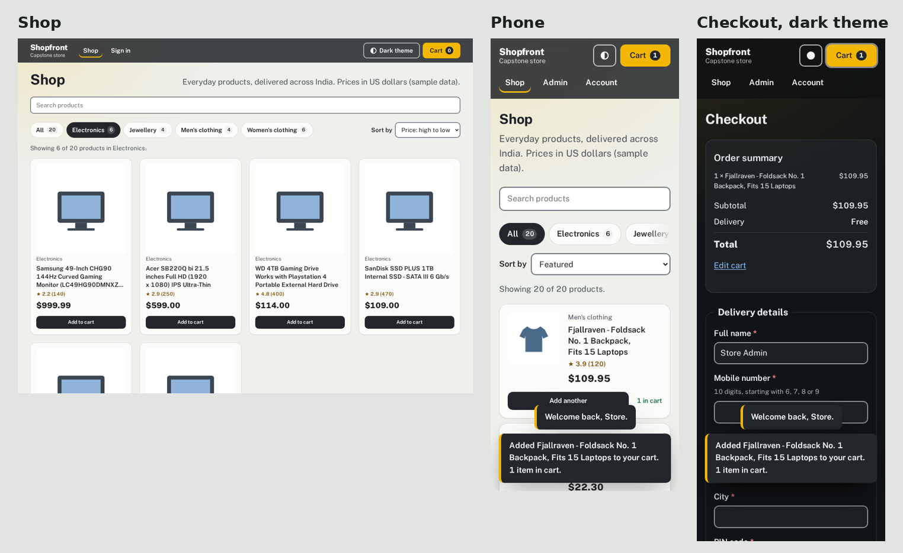
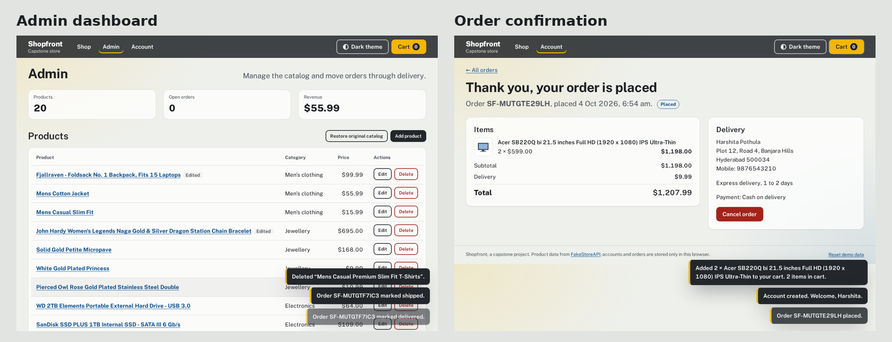
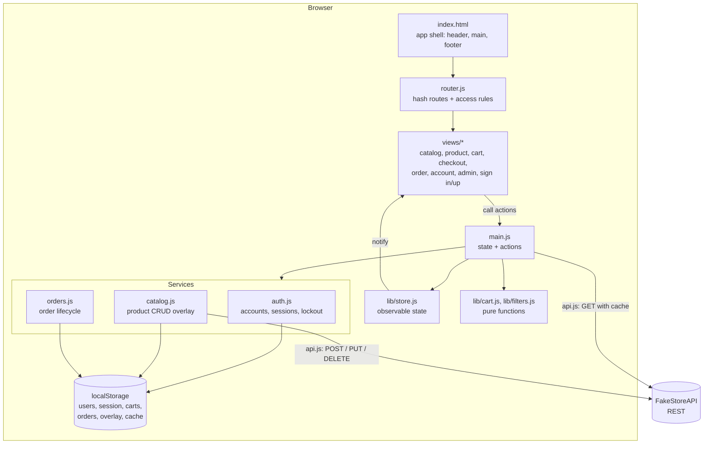
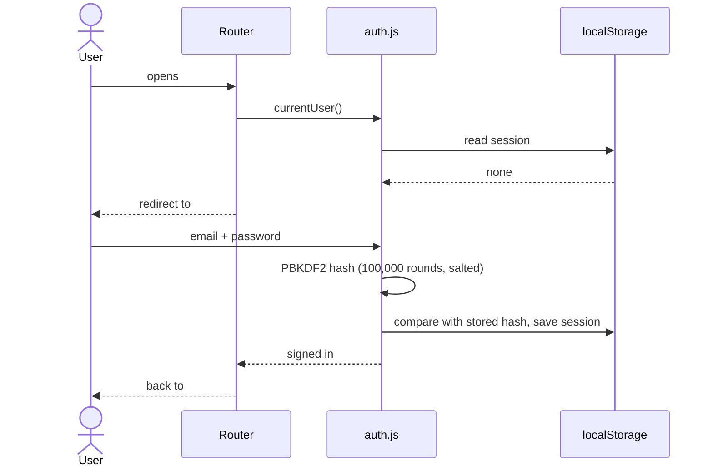
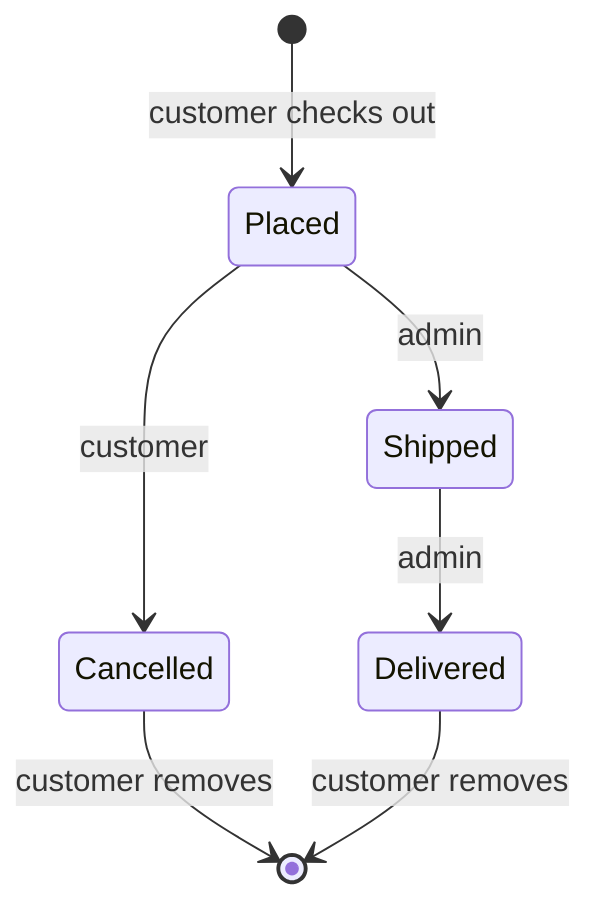

# Shopfront: E-Commerce Storefront (Capstone)

A complete, accessible online store built with plain HTML, CSS and modern JavaScript: accounts, a live product catalog, cart, checkout, order tracking and an admin dashboard. No frameworks, no build step, no dependencies.

**Live demo:** https://comfy-nougat-418496.netlify.app

**Try it with a demo account:**

| Role | Email | Password |
|------|-------|----------|
| Admin | `admin@shopfront.dev` | `Admin1234` |
| Customer | `demo@shopfront.dev` | `Demo1234` |

Or create your own account. The sign-in page has "Fill in" buttons for both demo accounts.





## Features

### For customers
- **Browse a live catalog** from [FakeStoreAPI](https://fakestoreapi.com): search as you type, category tabs (arrow keys work), sorting, and product pages.
- **Cart** with quantity controls, saved on the device. Items added before signing in are moved into your account when you sign in.
- **Accounts**: sign up, sign in, "keep me signed in", sign out.
- **Checkout** with delivery details, delivery speed and pay-on-delivery options. Every field is validated, with an error summary that links to each problem.
- **Orders**: confirmation page, order history, cancel (before it ships), remove finished orders from history.

### For admins
- **Product management (CRUD)**: add, edit and delete products, or restore the original catalog. Changes are also sent to the REST API (`POST`, `PUT`, `DELETE`).
- **Order management**: move orders from placed to shipped to delivered.
- **Dashboard figures**: product count, open orders and revenue.

### Quality
- **Accessible (WCAG 2.1 AA)**: semantic landmarks, skip link, visible focus, labelled forms, ARIA tabs, focus moves to each new page's heading, focus-trapping dialogs, screen reader announcements. **0 violations** in an automated axe-core audit of 12 screens in both themes.
- **Responsive and mobile-first** from 320px to wide desktop, with light and dark themes (follows the device setting, with a toggle).
- **Resilient**: request timeouts and retries, friendly error banners and loading skeletons. If FakeStoreAPI is slow or down, the store uses recently cached products, and if there are none it falls back to a catalog snapshot bundled with the site, so it always works.
- **Secure by default**: strict Content Security Policy and security headers, all data rendered as text (never as HTML), hashed passwords.

## Architecture



**How a user action flows:** a view never changes data itself. It calls an action in `main.js` (for example `addToCart`), which uses a service or pure function to compute the new data, saves it, and updates the store. The store notifies the views that care, and they redraw only what changed.

### Sign-in and protected pages



Route access levels: anyone (`/`, `/product/:id`, `/cart`), signed-in users (`/checkout`, `/account`, `/orders/:id`), admins (`/admin`), and guests only (`/signin`, `/signup`). A customer opening `/admin` sees an "Admins only" page.

### Product data: API plus local changes

FakeStoreAPI accepts `POST`, `PUT` and `DELETE` requests but doesn't store them. So the app keeps the API's products untouched and stores admin changes as an **overlay** (added products, edited fields, deleted ids). The catalog shown is always `API products + overlay`, which also makes "Restore original catalog" a one-line reset.

### Order lifecycle



## Project structure

```
shopfront-capstone/
├── index.html               # App shell
├── css/style.css            # Design tokens, themes, components (mobile-first)
├── js/
│   ├── main.js              # Entry point: state, actions, routes
│   ├── router.js            # Hash router with access rules
│   ├── api.js               # REST client: timeout, retries, cache, errors
│   ├── theme.js             # Light/dark theme
│   ├── services/
│   │   ├── auth.js          # Sign up/in/out, hashing, sessions, lockout
│   │   ├── catalog.js       # Product CRUD + validation
│   │   └── orders.js        # Place, cancel, remove, advance orders
│   ├── lib/
│   │   ├── store.js         # Observable state container
│   │   ├── storage.js       # Safe localStorage wrapper
│   │   ├── cart.js          # Pure cart functions
│   │   ├── filters.js       # Pure search/filter/sort functions
│   │   ├── forms.js         # Accessible validation + error summary
│   │   ├── dialogs.js       # Modal and confirm dialogs (native <dialog>)
│   │   └── dom.js           # Safe element builders, formatting
│   └── views/               # One file per page
├── tests/                   # 42 unit tests (Node's built-in runner)
├── data/                    # Catalog snapshot used if the API is unreachable
├── images/                  # Illustrations for the snapshot
├── _headers                 # Security headers for Netlify
├── vercel.json              # Same headers for Vercel
├── fonts/                   # Public Sans, self-hosted
└── screenshots/
```

## Run locally

The app uses JavaScript modules, which browsers only load from a web server (opening `index.html` directly shows a blank page).

```bash
git clone <this-repo-url>
cd shopfront-capstone
python -m http.server 8000      # or: npm start
```

Open <http://localhost:8000>. In VS Code, the **Live Server** extension also works.

**Run the tests** (Node 20 or newer, nothing to install):

```bash
npm test
```

**Demo modes** for checking error handling: add `?demo=slow`, `?demo=error` or `?demo=offline` before the `#` in the address, for example `/?demo=error#/`.

## Deployment

The site is fully static, so it deploys anywhere with no build step:

- **Netlify** (used for the live demo): drag this folder onto Netlify's deploy page. The `_headers` file applies the security headers automatically.
- **Vercel**: import the repository with the default settings; `vercel.json` applies the same headers.
- **GitHub Pages**: works as-is (custom headers aren't supported there).

Hash-based routing (`#/cart`) means no server rewrite rules are needed on any host.

## Testing and quality checks

| Check | Result |
|-------|--------|
| Unit tests: auth (hashing, lockout, sessions), product CRUD and validation, order lifecycle and permissions, router access rules, API client, cart, filters | **42 / 42 pass** |
| End-to-end browser tests (Playwright, Chromium) with the production security headers active: full customer journey, admin CRUD, route guards, persistence, API outage fallback, error states, layout at 5 widths in 2 themes | **61 / 61 pass** |
| Accessibility audit (axe-core, WCAG 2.1 A/AA + best practices), 12 screens in light and dark themes | **0 violations** |
| W3C HTML and CSS validator | **0 errors, 0 warnings** |
| Content Security Policy violations during the full test run | **0** |
| Horizontal scrolling on any page from 320px to 1440px | **None** |

## Honest limitations

This is a front-end portfolio project, so some things are simulated:

- **Accounts live in the browser.** Passwords are hashed and never stored, but anyone with access to the browser can read or edit localStorage. A real store would use a server with proper authentication.
- **Data is per browser.** Orders and admin changes aren't shared between devices or people.
- **Payments are pay-on-delivery only.** No card details are collected.
- **Prices are FakeStoreAPI sample data** in US dollars.
- **The bundled fallback catalog** (`data/`) uses simple illustrations instead of product photos; it only appears when FakeStoreAPI can't be reached.

## Built with

HTML5, CSS (custom properties, Grid, Flexbox, `clamp()`, `backdrop-filter`), JavaScript ES2022 modules, the Web Crypto API (PBKDF2), the native `<dialog>` element, FakeStoreAPI, Node's test runner, Playwright and axe-core for testing. Font: Public Sans (SIL Open Font License).

Built by Harshita Pothula as the final capstone of the RabTech web development internship.
