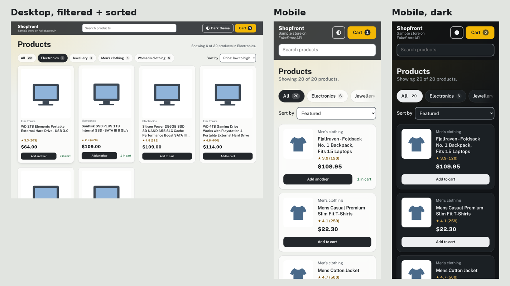
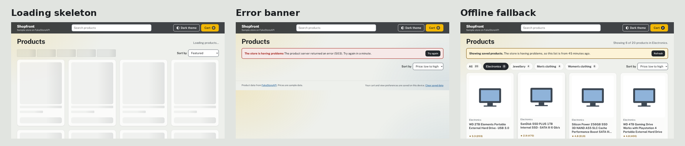

# Shopfront: Async JavaScript & REST API Client

A product catalogue that loads live data from [FakeStoreAPI](https://fakestoreapi.com) with `async`/`await`, filters it in real time, and keeps the cart and view preferences in `localStorage`. Written in modular ES6+ JavaScript with no frameworks and no dependencies.





## Features

| Requirement | How it's done |
|-------------|---------------|
| **async/await fetch from a REST API** | `api.js` calls `GET /products` and `GET /products/categories` in parallel with `Promise.allSettled`. Each request has an 8-second timeout (`AbortController`) and retries network errors, timeouts and 5xx responses twice, waiting 400ms then 800ms. |
| **Real-time search** | Results update as you type (debounced by 150ms). Every word must match the title, category or description, ignoring case and accents. Press `/` to jump to search. |
| **Category tabs** | Built from the categories endpoint, with product counts. Follows the WAI-ARIA tabs pattern: arrow keys, Home and End move between tabs. |
| **Sorting** | Featured, price low to high, price high to low, top rated, name A to Z. |
| **No page reloads** | All updates happen in the DOM. The address bar updates with `history.replaceState` (e.g. `?q=ssd&category=electronics`), so filtered views can be shared or bookmarked. |
| **localStorage state** | Cart items, last category and sort order are saved on the device. The cart also stays in sync across open tabs (`storage` event). API responses are cached for 10 minutes. |
| **Error banners** | Friendly messages for each failure type (offline, timeout, server error, rejected request, bad data), with a "Try again" button. Errors use `role="alert"`. |
| **Offline fallback** | If the API fails but older cached data exists, the products still show, with a warning banner saying how old they are. |
| **Loading skeletons** | Shimmering placeholder cards and tabs while data loads; the list is marked `aria-busy="true"`. Shimmer stops for users who prefer reduced motion. |
| **Empty state** | "No products match …" with buttons to clear the search or show all categories. |

## Project structure

```
shopfront/
├── index.html
├── css/style.css            # Shared design tokens + store components, mobile-first
├── js/
│   ├── app.js               # Entry point: loads data, holds state, wires events to the UI
│   ├── api.js               # REST client: fetch, timeout, retries, errors, cache
│   ├── state.js             # Observable store, localStorage and URL persistence
│   ├── filters.js           # Pure search / category / sort functions
│   ├── cart.js              # Pure cart functions (add, quantity, remove, totals)
│   ├── ui.js                # All DOM rendering (skeletons, cards, tabs, banner, cart)
│   └── theme.js             # Light / dark theme toggle
├── tests/                   # Unit tests (Node's built-in test runner, no installs)
│   ├── api.test.js
│   ├── filters.test.js
│   ├── cart.test.js
│   └── fixtures/            # Sample data in the exact FakeStoreAPI response shape
├── fonts/                   # Public Sans, self-hosted
└── screenshots/
```

### How the modules fit together

```
 user action ──> app.js ──> store.set() ──> subscribers ──> ui.js updates the DOM
                   │                            │
                   │                            └──> state.js saves cart + prefs to localStorage, URL
                   └──> api.js ──> fetch ──> FakeStoreAPI
                          └──> localStorage cache (fresh: skip network, stale: fallback on failure)
```

- **`api.js`** knows nothing about the DOM. It returns data, or throws an `ApiError` with a `kind` (`offline`, `timeout`, `http`, `parse`, `network`). `describeError()` turns that into the banner text.
- **`filters.js` and `cart.js`** are pure functions: same input, same output, no side effects. Cart functions return a new array instead of changing the old one, which makes changes easy to detect and test.
- **`ui.js`** builds elements with `textContent`, never `innerHTML` with API data, so product text can't inject HTML (XSS-safe).
- **`app.js`** is the only file that connects them.

## Run it

ES modules need a web server; double-clicking `index.html` won't load them. From this folder, run:

```bash
python -m http.server 8000
```

then open <http://localhost:8000>. In VS Code, the **Live Server** extension works too.

### Demo modes (for reviewing error handling)

Add one of these to the URL to see each state without breaking anything:

| URL | Shows |
|-----|-------|
| `?demo=slow` | Loading skeletons (2.5-second delay) |
| `?demo=error` | Server error banner (simulated 503) with "Try again" |
| `?demo=offline` | Offline banner |

## Testing

**Unit tests**: 24 tests, run with `npm test` (Node 20+, nothing to install). They cover search, category filtering and sorting; cart maths (including floating point: $0.10 + $0.20 = $0.30); corrupted localStorage data; the API client's caching, cache expiry, retries on 5xx, no retries on 4xx, timeouts, offline handling, stale-cache fallback and bad-data rejection.

**Browser tests**: 44 automated checks in Chromium (Playwright), all passing:

- skeleton shown and `aria-busy` set while loading
- 20 products and 5 tabs render; status text announces the count
- typing "ssd" shows 2 products, updates the URL, and does not reload the page
- tabs work with mouse and arrow keys; sorting works both ways
- cart: add, quantity +/-, remove, correct totals, Esc closes and returns focus
- cart, category and sort survive a page reload
- API down with old cache shows saved products and a warning; API down with no cache shows the error banner; "Try again" recovers
- no horizontal scrolling at 320, 375, 640, 768, 1024 and 1440px in light and dark themes
- no JavaScript errors

The browser tests answer API calls with the fixture data so they can force errors on purpose. That's why product photos in the screenshots are simple drawings; the live site shows the real FakeStoreAPI images.

The page also passes the W3C HTML and CSS validator with 0 errors and 0 warnings.
